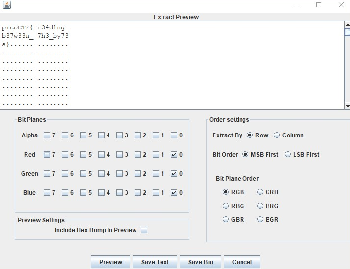

# Reading Between the Eyes

1. Download [stegsolve](http://www.caesum.com/handbook/Stegsolve.jar)
2. file -> open [husky.png](husky.png)
3. analyse -> data extract
4. Select least significant bits for red, green and blue and click preview 

Flag: `picoCTF{r34d1ng_b37w33n_7h3_by73s}`