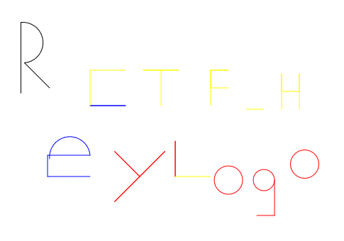

# draw

We got the following code.
```
cs pu lt 90 fd 500 rt 90 pd fd 100 rt 90 repeat 18[fd 5 rt 10] lt 135 fd 50 lt 135 pu bk 100 pd setcolor pick [ red orange yellow green blue violet ] repeat 18[fd 5 rt 10] rt 90 fd 60 rt 90 bk 30 rt 90 fd 60 pu lt 90 fd 100 pd rt 90 fd 50 bk 50 setcolor pick [ red orange yellow green blue violet ] lt 90 fd 50 rt 90 fd 50 pu fd 50 pd fd 25 bk 50 fd 25 rt 90 fd 50 pu setcolor pick [ red orange yellow green blue violet ] fd 100 rt 90 fd 30 rt 45 pd fd 50 bk 50 rt 90 fd 50 bk 100 fd 50 rt 45 pu fd 50 lt 90 pd fd 50 bk 50 rt 90 setcolor pick [ red orange yellow green blue violet ] fd 50 pu lt 90 fd 100 pd fd 50 rt 90 fd 25 bk 25 lt 90 bk 25 rt 90 fd 25 setcolor pick [ red orange yellow green blue violet ] pu fd 25 lt 90 bk 30 pd rt 90 fd 25 pu fd 25 lt 90 pd fd 50 bk 25 rt 90 fd 25 lt 90 fd 25 bk 50 pu bk 100 lt 90 setcolor pick [ red orange yellow green blue violet ] fd 100 pd rt 90 arc 360 20 pu rt 90 fd 50 pd arc 360 15 pu fd 15 setcolor pick [ red orange yellow green blue violet ] lt 90 pd bk 50 lt 90 fd 25 pu home bk 100 lt 90 fd 100 pd arc 360 20 pu home
```

If you google a few first instructions you can see it's logo language. Just paste this code into [the interpreter](https://www.calormen.com/jslogo/) and you should get the flag.

Result: 


Flag is `RCTF_HeyLogo`