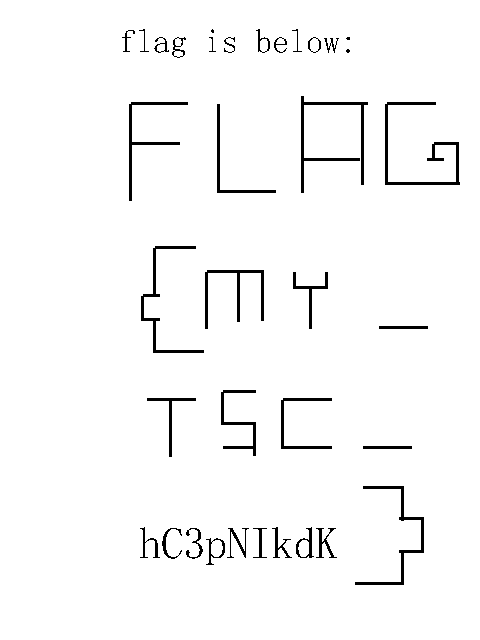

# printer

In this challenge we got `Printer.pcapng` capture file and the title suggests that we'll need to analyze some printer packets.

When we open the file in wireshark and scroll through the packets, we can see that one of them (no. 675) contains some `BITMAP` and `BAR` keywords. It looks like data to print.

We can check the protocol details in [some manual](https://www.dobus.ru/pdf/programming-manual-for-ht300.pdf) and then simulate printer's behaviour in python.

[Final script](printer.py)

Result: 

Flag is `flag{my_tsc_hc3pnikdk}`